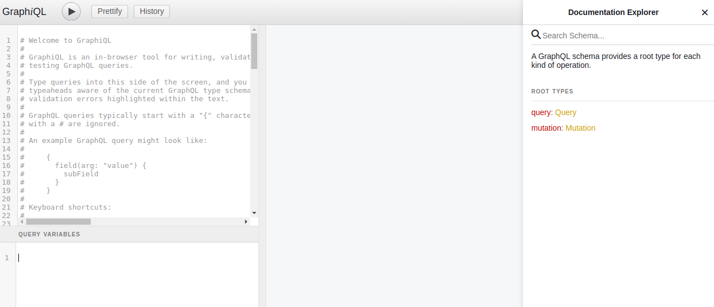

# GoodGradesServer [](https://circleci.com/gh/jde-agr/GoodGradesServer)

## Summary

This is the server for Good Grades which currently manages server side api calls that are used by the client (https://github.com/Onex101/GoodGrades).


## Project Objectives

* Solving the problem of poor effectiveness when tutoring in person (offline) in a way that is cost effective and beneficial to both the student and tutor (**main objective**)

* Creating a web application that can allow a tutor and student to connect (online) and have tutoring sessions done remotely (**accessibility**)

* Having a means to distinguish between a student and a tutor and the different functionalities they have access to (**user management**, **user roles**)

* Enabling a tutor and student to easily maneuver around the application (**intuitive**, **UI/UX**)

* Simplify the process of making/booking tutoring sessions, as well as having an overview of tutor sessions that are open/booked (**views**, **filtering**)

* Dynamic data is necessary in order to have accurate indications of when a slot has been made/has been booked (**web sockets**)

* Please feel free to look at the [project proposal](./resources/WeThinkCode_Request_for_proposal.pdf) given to us for this project (Note: We have blacked out contact details for the sake of privacy)

## Prerequisites
You will need the following in order to help install and configure all the necessary packages and database setup.

> PostgreSQL
>
> Node
>
> NPM

## PostgreSQL Database Setup
We assume that you have PostgreSQL installed and make use of the default user to configure our database.

First enter PostgreSQL's shell using the command
```sh
$ psql postgres
```
Within the shell, we create a database for our project called **good_grades**, as well as the user who will manage this database called **good_grades_user** with the password **p@ssword1** and give them all privileges in order to have full CRUD accessibility to the database. 

>Please note that this is hardcoded into our code for the sake of easy setup and is not something one would do realistically as it is unsafe to store credentials with your source code (bad coding practice).
>

```sh
$ CREATE DATABASE good_grades;
$ CREATE USER good_grades_user WITH ENCRYPTED PASSWORD 'p@ssword1';
$ GRANT ALL PRIVILEGES ON DATABASE good_grades TO good_grades_user;
```

You can now exit the PostgreSQL shell using the command
```sh
$ \q
```

## GoodGrades Server Setup
First clone the repo using
```sh
$ git clone https://github.com/jde-agr/GoodGradesServer.git
```
You can see the **main** folder structure is as follows (only listing files and folders relevant for the SQL implementation of this project):
```
GoodGradesServer 
│
│   .env
│   db.js
│   index.js
│   README.md
│   
└───api_sql
│
└───resolvers_sql
│
└───schema_sql
│
└───sockets
```

We would need to have both the **server side** and **client side** running at the **same time**. This is because our server is responsible for serving the relevant data that our client side needs in order to operate. 

### Server Side (SQL)

We need to install all the dependencies by using the command
```sh
$ npm install
```

Once all the dependencies have been installed, we can proceed to running the actual server by using the command
```sh
$ npm start
```
The server will run on port **5000** when run on **localhost**

### Client Side
The client side is kept in a seperate repo (https://github.com/Onex101/GoodGrades). Please refer to it's README file.

### Testing
We made use of GraphQL's popular GUI called **GraphiQL** in order to test our queries and mutations that would occur (CRUD).

You can view this GUI on the /graphql endpoint in your browser (Note: We assume that you are running the server on your localhost on port 5000)

See below the url we insert in the browser (i.e. Chrome)
```
http://localhost:5000/graphql
```

Below is an image of what the GraphiQL GUI looks like

